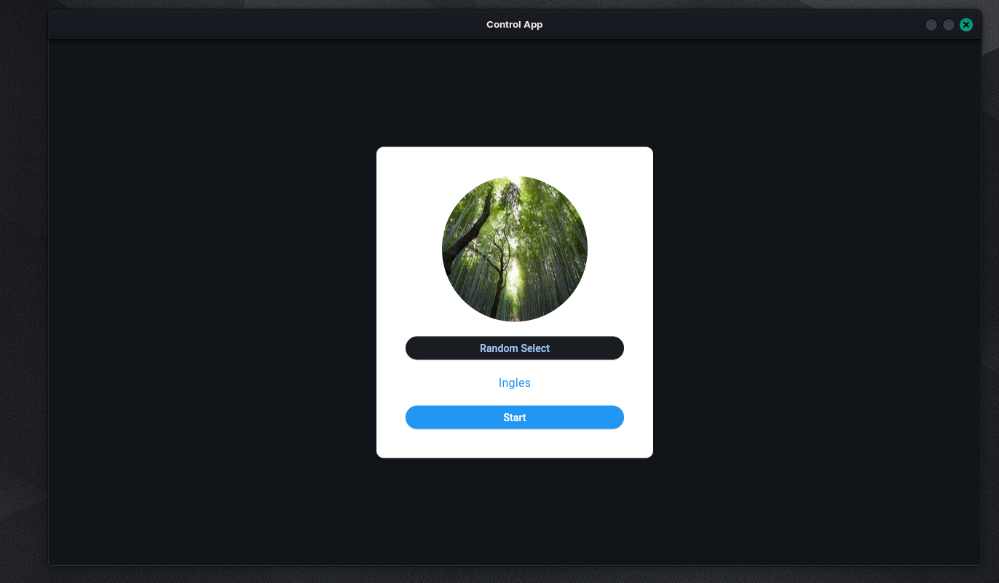
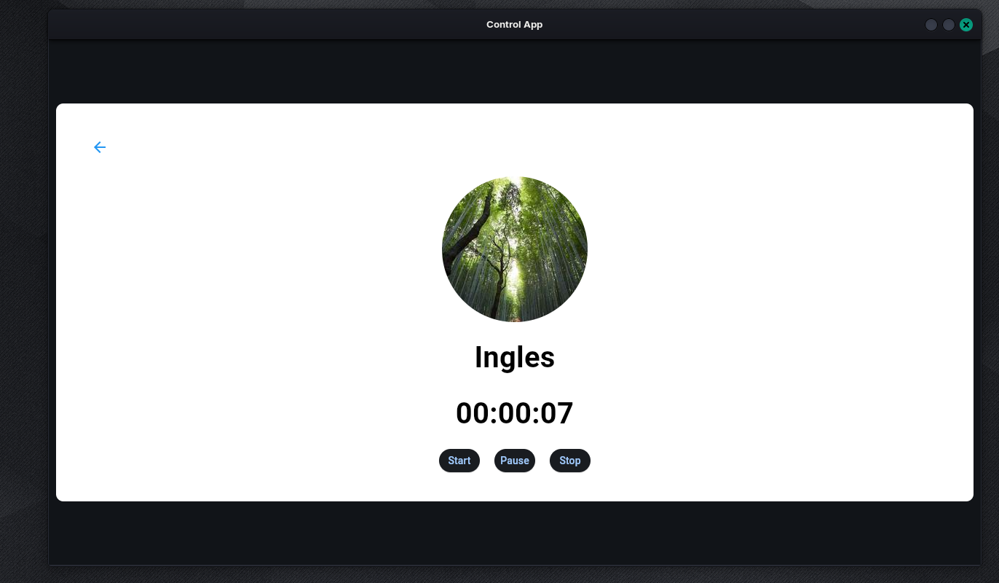

# Flet app

Flet app using Flet extension.

To run the app:

1. Install dependencies from pyproject.toml:

```
poetry install
```

2. Build app:

```
poetry run flet build macos -v
```

3. Run app:

```
poetry run flet run
```

# Example Execute

 ### Home


 ### Tracker Stop


 ### Tracker Start

